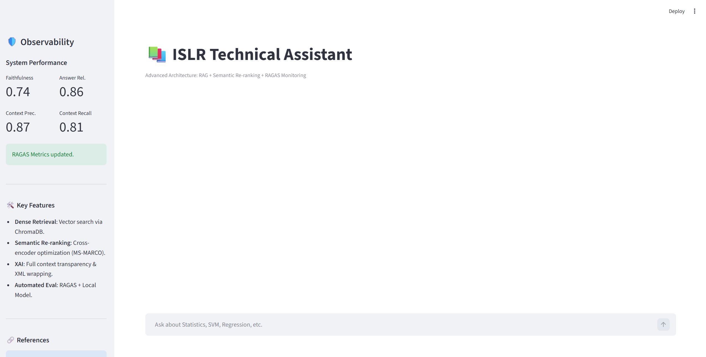
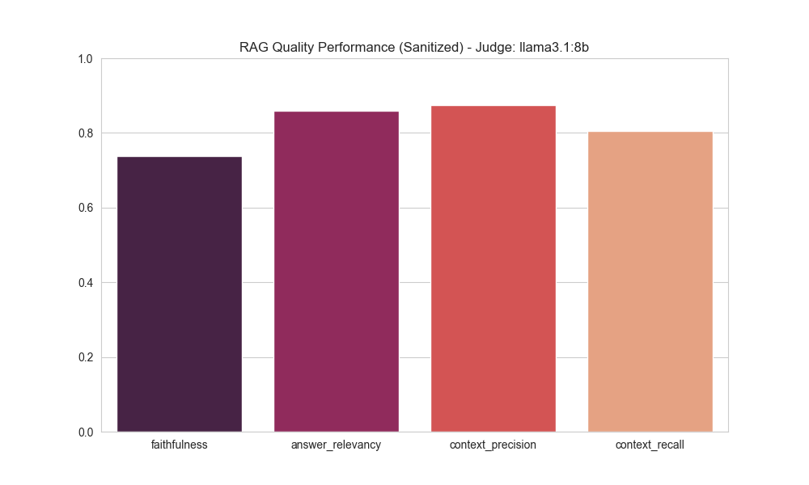

# Scanntech RAG System - ISLR Technical Assistant

   

> **Repositorio oficial para el Scanntech AI Engineer Challenge.**

## 🚀 Executive Summary

Este proyecto implementa un ecosistema **RAG (Retrieval-Augmented Generation)** de nivel industrial diseñado para transformar el libro *"An Introduction to Statistical Learning" (ISL)* en un asistente técnico interactivo y auditable.

A diferencia de un chat básico con PDFs, este sistema integra principios de ingeniería de software robusta:

* **Semantic Re-ranking & XAI:** Implementación de una arquitectura de recuperación en dos pasos (Bi-Encoder + Cross-Encoder `ms-marco`). Esto asegura que solo el contexto de alta calidad llegue al LLM. Además, la interfaz incluye herramientas de **Explicabilidad (XAI)** para que el usuario audite qué fragmentos del libro se utilizaron.
* **Automated Evaluation Framework:** Integración nativa de **RAGAS** utilizando **Llama 3.1 (8B)** como juez local. El sistema se auto-evalúa continuamente en métricas de *Fidelidad*, *Relevancia*, *Precisión de Contexto* y *Recall*.
* **Unified Ecosystem:** Un orquestador central (`main.py`) gestiona el ciclo de vida completo: desde la ingesta ETL jerárquica hasta la evaluación y el despliegue de la interfaz de usuario.

---

## 📸 Visual Showcase

### 1. The Orchestrator (CLI)
Gestión centralizada del pipeline de datos y evaluación.


### 2. User Interface & Observability
Dashboard interactivo con métricas de RAGAS en tiempo real y transparencia de contexto.


### 3. Performance Metrics
Resultados del benchmark maestro evaluado sobre el *Ground Truth* del libro.


---

## 🏗️ Arquitectura Técnica (Free Style Presentation)

El sistema supera los retos tradicionales de los RAGs (alucinaciones y pérdida de contexto) mediante tres pilares:

### 1. Ingesta Jerárquica (`ingestion.py`)
No se limita a cortar texto. Utiliza `PyMuPDF4LLM` y análisis de TOC (Tabla de Contenidos) para:
* **Limpieza de Ruido:** Elimina índices, bibliografías y encabezados repetitivos.
* **Metadatos Estructurales:** Cada vector está etiquetado con su `Capítulo`, `Subcapítulo` y `Sección` exacta.
* **Preservación Matemática:** Detecta y formatea ecuaciones en LaTeX/Markdown para que no se pierda la lógica estadística.

### 2. Recuperación Híbrida ("Two-Pass Retrieval")
* **Paso 1 (Broad):** Búsqueda vectorial con `nomic-ai/nomic-embed-text-v1.5` (Top-15). Este modelo de alta densidad (Matryoshka) permite una recuperación semántica superior.
* **Paso 2 (Deep):** Re-ranking con Cross-Encoder `ms-marco-MiniLM-L-6-v2`. Se aplica un umbral estricto (`score > -3.5`) para filtrar ruido.

### 3. Evaluación Sanitizada (`evaluator.py`)
Se descubrió que los modelos jueces pequeños (8B) fallan al evaluar texto con mucho LaTeX. Se implementó un algoritmo de **Sanitización** que convierte fórmulas complejas en tokens `[MATH_BLOCK]` antes de pasar por el juez, elevando la fiabilidad de las métricas.

---

## 🛠️ Setup Guide

Sigue estos pasos para replicar el entorno en local.

### 1. Prerrequisitos y Matriz de Modelos
Este sistema combina inferencia local vía Ollama y modelos especializados de HuggingFace (configurados en `src/config.py`).

**Modelos Utilizados:**
* **Chat LLM:** `llama3.2:3b` (Optimizado para baja latencia en inferencia).
* **Judge LLM:** `llama3.1:8b` (Capacidad de razonamiento superior para evaluación RAGAS).
* **Embeddings:** `nomic-ai/nomic-embed-text-v1.5` (Gestionado por `langchain-huggingface`).

**Instalación de Motores:**
1.  Descarga e instala [Ollama](https://ollama.com).
2.  Descarga los modelos LLM requeridos:

```bash
# Modelo para el Chat
ollama pull llama3.2:3b

# Modelo Juez para RAGAS
ollama pull llama3.1:8b
```

*Nota: El modelo de embeddings (`nomic-embed-text-v1.5`) y el Cross-Encoder se descargarán automáticamente en la carpeta de caché de HuggingFace durante la primera ejecución de la ingesta.*

### 2. Instalación del Entorno

```bash
# 1. Clonar el repositorio
git clone <https://github.com/Joxhel/scanntech-rag-system>
cd scanntech-rag-system

# 2. Crear y activar entorno virtual (Recomendado)
python -m venv .venv
source .venv/bin/activate  # Mac/Linux
# .\.venv\Scriptsactivate # Windows PowerShell

# 3. Instalar dependencias
pip install -r requirements.txt
```

---

## ⚡ Execution Flow

El proyecto cuenta con un `main.py` que centraliza todas las operaciones.

### Paso 1: Iniciar el Orquestador
Ejecuta el siguiente comando en tu terminal:

```bash
python main.py
```

### Paso 2: Seleccionar Operación
Verás un menú interactivo con las siguientes opciones:

1.  **🛠️ INGESTA:** Procesa el PDF `GenAI Challenge.pdf` y crea/actualiza la base de datos vectorial en `db/chroma_db_storage`.
    * *Nota: Se incluye una versión pre-cargada de la DB en el repo para pruebas rápidas.*
2.  **📊 EVALUACIÓN:** Ejecuta el benchmark de RAGAS. Compara las respuestas del sistema contra el `ground_truth.json` y genera un reporte en CSV.
3.  **💬 CHAT:** Lanza automáticamente la interfaz web de Streamlit.

### Alternativa: Lanzamiento Directo
Si ya tienes la base de datos y quieres ir directo al chat:

```bash
streamlit run app.py
```

---

## 📂 Project Structure

```text
scanntech-rag-system/
├── assets/             # Imágenes y evidencias para el README
├── data/               # Documentos fuente (PDF del libro ISLR)
├── db/                 # Persistencia de ChromaDB (Pre-cargada)
├── eval/               
│   ├── benchmark/      # Ground Truth (QA pairs) para evaluación
│   ├── logs/           # Trazabilidad de interacciones (JSONL)
│   └── reports/        # Gráficos y CSV generados por RAGAS
├── src/                
│   ├── __init__.py
│   ├── config.py       # Single Source of Truth (Rutas, Modelos, Configuración)
│   ├── ingestion.py    # Pipeline ETL (Limpieza, TOC Hierarchy, Indexación)
│   ├── query_rag.py    # Motor RAG (Retrieval + Re-ranker + Chain of Verification)
│   └── evaluator.py    # Lógica de métricas RAGAS con sanitización de texto
├── app.py              # Interfaz de Usuario (Streamlit Dashboard)
├── main.py             # CLI Entrypoint (Orquestador)
├── requirements.txt    # Dependencias del proyecto
└── README.md           # Documentación oficial
```

---

## 🛡️ License & Contact

Desarrollado por **Jose Luis Cabrera Vega** para el proceso de selección de **Scanntech**.
