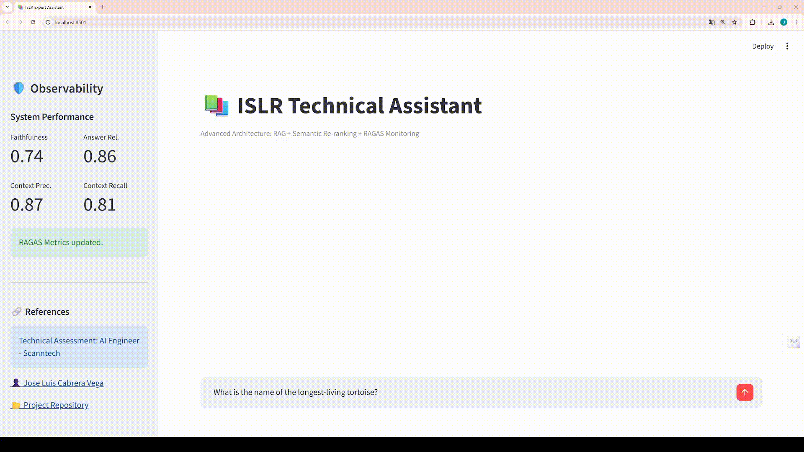

# Scanntech RAG System - ISLR Technical Assistant

   

> **Repositorio oficial desarrollado para el Scanntech AI Engineer Challenge.**

## 🚀 Resumen del Proyecto

Este sistema nace de la necesidad de transformar el libro *"An Introduction to Statistical Learning" (ISL)* en un asistente técnico inteligente. El objetivo principal fue construir un ecosistema que no solo responda preguntas técnicas con precisión, sino que ofrezca **transparencia total** sobre las fuentes consultadas y mantenga un **control de calidad riguroso** mediante métricas automatizadas.

A lo largo del desarrollo, implementé una arquitectura basada en tres pilares:
* **Recuperación Semántica Avanzada:** Uso de un flujo de dos pasos (Retrieval + Re-ranking) para asegurar que el modelo trabaje solo con la información más pertinente.
* **Observabilidad en Tiempo Real:** Integración de un panel de métricas RAGAS directamente en la interfaz para monitorear la salud del sistema.
* **Ingesta con Preservación Técnica:** Enfoque en la extracción limpia de fórmulas matemáticas y estructuras jerárquicas del PDF original.

---

## 📸 Evidencias del Sistema (Visual Showcase)

### 1. El Orquestador Central (CLI)
Desarrollé un punto de entrada único (`main.py`) que permite gestionar todo el ciclo de vida del dato: desde la ingesta inicial hasta la ejecución de benchmarks de evaluación.


### 2. Dashboard de Usuario y Observabilidad
La interfaz en Streamlit prioriza la experiencia del usuario. El panel lateral muestra los promedios históricos de las métricas de calidad, permitiendo validar la confianza del sistema antes de iniciar el chat.


### 3. Rendimiento y Métricas RAGAS
El sistema genera reportes visuales tras cada evaluación masiva, facilitando la identificación de puntos de mejora en la fidelidad y relevancia de las respuestas.


---

## 🏗️ Arquitectura y Preprocesamiento Avanzado

El núcleo del proyecto reside en cómo se preparan y recuperan los datos técnicos. Aquí detallo las decisiones clave en `src/ingestion.py`, `src/query_rag.py` y `src/evaluator.py`:

### 1. Ingesta Inteligente con PyMuPDF4LLM
Para manejar la complejidad del libro ISLR, utilicé `PyMuPDF4LLM` combinado con lógica personalizada para:
* **Extracción de Fórmulas y LaTeX:** A diferencia de otros extractores, este flujo preserva la sintaxis matemática, permitiendo que el modelo comprenda las ecuaciones sin errores de caracteres extraños.
* **Análisis de Estructura Jerárquica:** El sistema mapea la Tabla de Contenidos (TOC) para inyectar metadatos de `Capítulo`, `Subcapítulo` y `Sección` en cada fragmento.
* **Limpieza Especializada:** Se eliminan ruidos de edición (DOIs, copyright) que suelen ensuciar los embeddings.

### 2. Recuperación de Dos Pasos (Two-Pass Retrieval)
* **Búsqueda Vectorial (Broad Search):** Recuperación inicial de 15 fragmentos usando `nomic-ai/nomic-embed-text-v1.5`.
* **Re-ranking Semántico (Deep Search):** Aplicación de un **Cross-Encoder** (`ms-marco`) para re-evaluar la relevancia de esos 15 fragmentos, filtrando cualquier contexto que no aporte valor real antes de enviarlo al LLM.

### 3. Evaluación y Sanitización Técnica
Para garantizar la fiabilidad de las métricas de **RAGAS**, implementé un flujo de evaluación especializado:
* **Juez Especializado:** Se utiliza `llama3.1:8b` como juez evaluador por su capacidad superior para seguir instrucciones complejas en comparación con modelos más pequeños.
* **Sanitización de Datos:** Desarrollé una lógica que convierte bloques de código y fórmulas complejas en tokens simplificados (`[MATH_BLOCK]`) antes de la evaluación. Esto evita que el juez se distraiga con la sintaxis de LaTeX y se enfoque puramente en la fidelidad semántica de la respuesta.
* **Métricas Core:** El sistema mide continuamente *Faithfulness*, *Answer Relevancy*, *Context Precision* y *Context Recall*.

---

## 📺 Demos de Interacción

### Interacción Técnica
El asistente explica conceptos estadísticos complejos citando la ubicación exacta en el libro para su verificación.


### Manejo de Preguntas Fuera de Dominio
El sistema identifica consultas que no pertenecen al dominio del libro (como cultura general), evitando alucinaciones y manteniendo el enfoque técnico.


---

## 🛠️ Guía de Instalación y Setup

### 1. Modelos de IA (Ollama)
Este sistema utiliza **Ollama** para la inferencia local. Asegúrate de tener instalados los siguientes modelos:
```bash
ollama pull llama3.2:3b  # Para el Chat (Velocidad)
ollama pull llama3.1:8b  # Para el Juez Evaluador (Razonamiento)
```

### 2. Entorno y Dependencias
El proyecto utiliza un archivo `requirements.txt` con versiones fijas para garantizar la reproducibilidad del entorno.
```bash
# Crear y activar ambiente (Recomendado Python 3.10 o 3.11)
python -m venv .venv
source .venv/bin/activate  # O .\\.venv\\Scripts\\activate en Windows

# Actualizar pip e instalar dependencias fijas
pip install --upgrade pip
pip install -r requirements.txt
```

---

## 📂 Project Structure

```text
scanntech-rag-system/
├── assets/             # Imágenes y evidencias para el README
├── data/               # Documentos fuente (PDF del libro ISLR)
├── db/                 # Persistencia de ChromaDB (Pre-cargada)
├── eval/               
│   ├── benchmark/      # Ground Truth (QA pairs) para evaluación
│   ├── logs/           # Trazabilidad de interacciones (JSONL)
│   └── reports/        # Gráficos y CSV generados por RAGAS
├── src/                
│   ├── __init__.py
│   ├── config.py       # Single Source of Truth (Rutas, Modelos, Configuración)
│   ├── ingestion.py    # Pipeline ETL (Limpieza, TOC Hierarchy, Indexación)
│   ├── query_rag.py    # Motor RAG (Retrieval + Re-ranker + Chain of Verification)
│   └── evaluator.py    # Lógica de métricas RAGAS con sanitización de texto
├── app.py              # Interfaz de Usuario (Streamlit Dashboard)
├── main.py             # CLI Entrypoint (Orquestador)
├── requirements.txt    # Dependencias del proyecto
└── README.md           # Documentación oficial
```

---

## ⚡ Execution Flow

El proyecto cuenta con un `main.py` que centraliza todas las operaciones.

### Paso 1: Iniciar el Orquestador
Ejecuta el siguiente comando en tu terminal:

```bash
python main.py
```

### Paso 2: Seleccionar Operación
Verás un menú interactivo con las siguientes opciones:

1. **🛠️ INGESTA:** Procesa el PDF `GenAI Challenge.pdf` y crea/actualiza la base de datos vectorial en `db/chroma_db_storage`.
    * *Nota: Se incluye una versión pre-cargada de la DB en el repo para pruebas rápidas.*
2. **📊 EVALUACIÓN:** Ejecuta el benchmark de RAGAS. Compara las respuestas del sistema contra el `ground_truth.json` y genera un reporte en CSV.
3. **💬 CHAT:** Lanza automáticamente la interfaz web de Streamlit.


### Alternativa: Lanzamiento Directo
Si ya tienes la base de datos y quieres ir directo al chat:

```bash
streamlit run app.py
```

---

## 🛡️ License & Contact

Desarrollado por [**Jose Luis Cabrera Vega**](https://www.linkedin.com/in/josecabrerav) para el proceso de selección de **Scanntech**.
